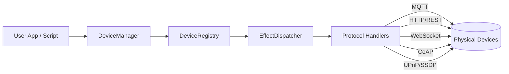

# PlaySEM - Sensory Effect Media Framework

[](https://github.com/PhelaPoscam/Python_PlaySEM/actions)
[](https://www.python.org/downloads/)
[](LICENSE)
[](https://github.com/psf/black)

**PlaySEM** is a Python platform and library for orchestrating sensory effects across multiple protocols — lighting, haptics, wind, scent, and more — with a single, production-ready API. 🚀

Based on and expanded from the PlaySEM Java framework by [Estevão Bissoli](https://github.com/estevaobissoli), bringing a more agile experience for creating immersive applications.

---

## Table of Contents
- [PlaySEM - Sensory Effect Media Framework](#playsem---sensory-effect-media-framework)
  - [Table of Contents](#table-of-contents)
  - [✨ Features](#-features)
  - [🚀 Quick Start](#-quick-start)
    - [Installation](#installation)
    - [Basic Usage](#basic-usage)
    - [Device Registry (Multi-Protocol)](#device-registry-multi-protocol)
    - [Protocol Isolation Mode](#protocol-isolation-mode)
  - [📦 What's Included](#-whats-included)
    - [Core Library (`playsem/`)](#core-library-playsem)
    - [Examples](#examples)
    - [Optional Components](#optional-components)
  - [📖 Documentation](#-documentation)
  - [🎯 Use Cases](#-use-cases)
    - [As a Library](#as-a-library)
    - [As a Platform](#as-a-platform)
  - [🔧 Development](#-development)
    - [Setup](#setup)
    - [Run Tests](#run-tests)
    - [Run Examples](#run-examples)
  - [🏗️ Architecture](#️-architecture)
    - [Protocol Handlers (Modular Design)](#protocol-handlers-modular-design)
  - [🧭 How it Works](#-how-it-works)
  - [🌟 What's New](#-whats-new)
    - [Version 0.1.0 - Library Release](#version-010---library-release)
  - [🤝 Contributing](#-contributing)
    - [Development Workflow](#development-workflow)
  - [📝 License](#-license)
  - [🔗 Links](#-links)
  - [🙏 Acknowledgments](#-acknowledgments)
  - [📊 Project Status](#-project-status)

---

## ✨ Features

- 🔌 **Multi-Protocol Support**: MQTT, WebSocket, Serial, CoAP, UPnP
- 🎯 **Device Registry**: Central management with optional protocol isolation
- 🔄 **Effect Routing**: Automatic effect dispatch based on device capabilities
- 🧩 **Extensible Drivers**: Easy plugin system for new hardware
- 🔒 **Thread-Safe**: Concurrent access from multiple protocols
- 🧪 **Well-Tested**: Comprehensive unit test coverage

---

## 🚀 Quick Start

### Installation

```bash
git clone https://github.com/PhelaPoscam/Python_PlaySEM.git
cd Python_PlaySEM
pip install -e .
```

### Basic Usage

<details>
<summary>Show basic usage example</summary>

```python
from playsem import DeviceManager, EffectMetadata

# Initialize
manager = DeviceManager()
await manager.initialize("config/devices.yaml")

# Send effect
effect = EffectMetadata(
    effect_type="vibration",
    intensity=80,
    duration=1000
)
await manager.send_effect("device_id", effect)
```

</details>

### Device Registry (Multi-Protocol)

<details>
<summary>Show device registry example</summary>

```python
from playsem import DeviceRegistry

# Create registry
registry = DeviceRegistry()

# Register devices from any protocol
registry.register_device({
    "id": "light_001",
    "name": "Smart Light",
    "type": "light",
    "protocols": ["mqtt"]
}, source_protocol="mqtt")

# Query devices (cross-protocol visibility!)
all_devices = registry.get_all_devices()
```

</details>

### Protocol Isolation Mode

<details>
<summary>Show protocol isolation example</summary>

```python
# Enable isolation (like Super Controller Device Simulator)
registry = DeviceRegistry(enable_protocol_isolation=True)

# MQTT devices only visible to MQTT clients
mqtt_devices = registry.get_all_devices(requesting_protocol="mqtt")

# WebSocket devices only visible to WebSocket clients
ws_devices = registry.get_all_devices(requesting_protocol="websocket")
```

</details>

---

## 📦 What's Included

### Core Library (`playsem/`)

```python
from playsem import DeviceManager, EffectMetadata, DeviceRegistry
from playsem.drivers import SerialDriver, MQTTDriver
from playsem.config import ConfigLoader
```

- **DeviceManager**: Device lifecycle and effect routing
- **EffectDispatcher**: Effect orchestration
- **DeviceRegistry**: Central device storage (NEW!)
- **Drivers**: Serial, MQTT, Bluetooth, Mock
- **Configuration**: YAML/JSON device config

### Examples

- `examples/simple_cli.py` - Basic usage
- `examples/device_registry_demo.py` - Multi-protocol demo

### Optional Components

- `tools/test_server/` - Multi-protocol backend server
- `gui/` - PyQt6 graphical interface

---

## 📖 Documentation

**Complete Library Documentation**: [`docs/LIBRARY.md`](docs/LIBRARY.md)

| Document | Description |
|----------|-------------|
| [`docs/LIBRARY.md`](docs/LIBRARY.md) | Complete API reference and usage guide |
| [`docs/REFACTORING.md`](docs/REFACTORING.md) | Refactoring progress and migration guide |
| [`docs/guides/quick-start.md`](docs/guides/quick-start.md) | Platform server setup |
| [`docs/guides/devices.md`](docs/guides/devices.md) | Device configuration |

---

## 🎯 Use Cases

### As a Library

```python
# Use PlaySEM in your own projects
from playsem import DeviceManager, DeviceRegistry

# Build your own control system
# Integrate with your application
# Create custom device drivers
```

### As a Platform

```bash
# Run the included platform server (module execution avoids sys.path hacks)
python -m tools.test_server.main_new

# Or use the GUI
python -m gui.app
```

---

## 🔧 Development

### Setup

```bash
python -m venv .venv
.venv\Scripts\activate  # Windows
pip install -e ".[dev]"
```

### Run Tests

```bash
pytest
pytest --cov=playsem
pytest -v
```

### Run Examples

```bash
python examples/simple_cli.py
python examples/device_registry_demo.py
```

---

## 🏗️ Architecture



### Protocol Handlers (Modular Design)

PlaySEM uses **isolated protocol handlers** for clean separation of concerns:

| Protocol | Handler | Purpose |
|----------|---------|---------|
| **MQTT** | `MQTTHandler` | Pub/Sub broker integration |
| **HTTP** | `HTTPHandler` | REST API endpoints |
| **WebSocket** | `WebSocketHandler` | Real-time bidirectional communication |
| **CoAP** | `CoAPHandler` | IoT/embedded devices (UDP) |
| **UPnP** | `UPnPHandler` | Device discovery via SSDP multicast |

Each handler follows the same interface:
```python
async def start() → None          # Start protocol server
async def stop() → None           # Stop protocol server
async def send_effect(...) → bool # Send effect to device
def get_status() → dict          # Get protocol status
```

**Location**: `tools/test_server/handlers/`

## 🧭 How it Works
- **Lib Core (playsem/)**: APIs e componentes que você importa no seu código (DeviceManager, DeviceRegistry, EffectDispatcher, drivers). Sem opinião de runtime; você controla o ciclo de vida.
- **Plataforma/Server (tools/test_server/)**: Backend FastAPI/WebSocket para multi-protocolo, timeline e testes. Usa a lib core e expõe endpoints/WS para clientes externos.
- **GUI (gui/)**: Interface PyQt6 que conversa com o servidor via WebSocket/HTTP.

---

## 🌟 What's New

### Version 0.1.0 - Library Release

✅ **Phase 1: Library Extraction**
- Core modules extracted to `playsem/` package
- Clean import structure: `from playsem import ...`
- Installable via `pip install -e .`

✅ **Phase 2: Device Registry**
- Central device storage across all protocols
- **Protocol Isolation Mode**: Optional device visibility control
- Cross-protocol device discovery
- Thread-safe concurrent access
- Event notification system

✅ **Phase 3: Modular Protocol Handlers**
- Extracted 5 protocol handlers (HTTP, CoAP, UPnP, MQTT, WebSocket)
- Standardized Pydantic configuration pattern
- Dependency injection for clean architecture
- Each protocol independently testable and deployable
- Consistent `start/stop/send_effect/get_status` interface

**Migration Guide**: See [`docs/REFACTORING.md`](docs/REFACTORING.md)

---

## 🤝 Contributing

We welcome contributions! Please see our [contribution guidelines](docs/CONTRIBUTING.md).

### Development Workflow

1. Fork the repository
2. Create a feature branch
3. Make your changes
4. Add tests
5. Submit a pull request

---

## 📝 License

MIT License - see [LICENSE](LICENSE) for details

---

## 🔗 Links

- **Repository**: https://github.com/PhelaPoscam/Python_PlaySEM
- **Issues**: https://github.com/PhelaPoscam/Python_PlaySEM/issues
- **Original Java PlaySEM**: https://github.com/estevaobissoli/PlaySEM

---

## 🙏 Acknowledgments

- Original PlaySEM framework by [Estevão Bissoli](https://github.com/estevaobissoli)
- Python implementation and extensions by PhelaPoscam

---

## 📊 Project Status

**Current Version**: 0.1.0 (Library Release)

| Component | Status |
|-----------|--------|
| Core Library | ✅ Stable |
| Device Registry | ✅ Complete (with protocol isolation) |
| Serial Driver | ✅ Working |
| MQTT Driver | ✅ Working |
| Bluetooth Driver | ⚠️ Experimental |
| Platform Server | ⚠️ Refactoring (Phase 3) |
| GUI | ✅ Working |
| Documentation | ✅ Complete |

---

<p align="center">
  <strong>Transform your ideas into immersive experiences with PlaySEM! 🎮✨</strong>
</p>
