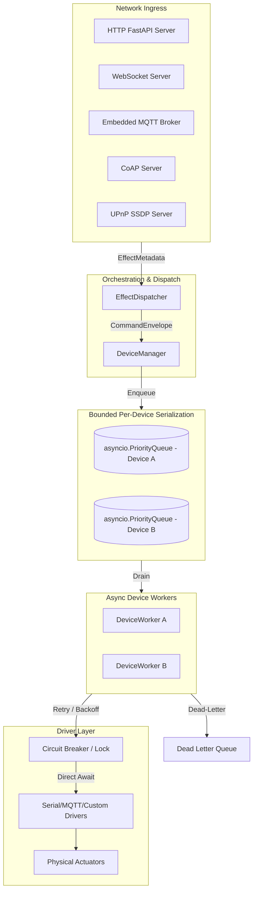

# PlaySEM — Sensory Effect Media Framework

[](https://github.com/PhelaPoscam/Python_PlaySEM/actions)
[](https://www.python.org/downloads/)
[](LICENSE)
[](https://github.com/psf/black)
[]()

**PlaySEM** is an enterprise-grade, highly concurrent, async-native Python framework for orchestrating sensory and haptic effects (vibration, wind, light, scent) across diverse hardware devices and networking protocols. 

It acts as a high-performance translation matrix between abstract haptic metadata schemas and physical physical devices.

---

## ⚡ Architectural Blueprint


```mermaid
flowchart TD
    subgraph Ingress_Layer [Network Ingress]
        HTTP[HTTP FastAPI Server]
        WS[WebSocket Server]
        MQTT_S[Embedded MQTT Broker]
        CoAP[CoAP Server]
        UPnP[UPnP SSDP Server]
    end

    subgraph Core [Orchestration & Dispatch]
        Dispatcher[EffectDispatcher]
        DM[DeviceManager]
    end

    subgraph Queues [Bounded Per-Device Serialization]
        Q1[(asyncio.PriorityQueue - Device A)]
        Q2[(asyncio.PriorityQueue - Device B)]
    end

    subgraph Workers [Async Device Workers]
        W1[DeviceWorker A]
        W2[DeviceWorker B]
    end

    subgraph Drivers [Driver Layer]
        CB[Circuit Breaker / Lock]
        SD[Serial/MQTT/Custom Drivers]
        Hardware[Physical Actuators]
    end

    Ingress_Layer -->|EffectMetadata| Dispatcher
    Dispatcher -->|CommandEnvelope| DM
    DM -->|Enqueue| Queues
    Queues -->|Drain| Workers
    Workers -->|Retry / Backoff| CB
    CB -->|Direct Await| SD
    SD --> Hardware
    Workers -->|Dead-Letter| DLQ[Dead Letter Queue]
```

---

## ✨ Features

- ⚡ **Native Async Architecture**: Non-blocking async-native dispatch loop prevents OOM errors and thread-creation overhead under high-volume haptic streams.
- 📦 **Command Envelopes (`CommandEnvelope`)**: Unified transaction data carrier supporting delivery priorities, time-to-live (TTL) deadlines, idempotency keys, and quality-of-service guarantees.
- 🚦 **Robust Backpressure**: Bounded per-device `asyncio.PriorityQueue` buffers that automatically serialize execution and apply backpressure to fast-producing ingress sources.
- 🛡️ **Fault Tolerance & Resilience**:
  - **Circuit Breakers**: Per-logical-device circuit breakers prevent system locks by automatically isolating unresponsive or crashing drivers.
  - **Exponential Backoff**: Automated message delivery retries with adaptive delays.
  - **Dead-Letter Queue (DLQ)**: Failed high-priority envelopes are safely captured for diagnostic review.
  - **Write Serialization**: Per-device async locks guarantee in-order delivery to serial ports and sockets without blocking the core event loop.
- 🔌 **Multi-Protocol Ingress**: Native servers for **FastAPI (HTTP)**, **WebSockets**, **MQTT** (featuring an embedded broker), **CoAP**, and **UPnP**.
- 🧪 **High-Fidelity Observational Testing**: Rich mock drivers with complete transactional history logs permit E2E system testing without requiring physical hardware present.

---

## 🚀 Quick Start

### Installation

```bash
# Core minimal setup
pip install -e .

# Full installation (FastAPI, amqtt, aiocoap, websockets)
pip install -e ".[all]"
```

### Async Dispatch Example

Below is a complete script demonstrating how to boot the `DeviceManager`, spin up the async workers, and safely dispatch haptic commands.

```python
import asyncio
from playsem import DeviceManager, EffectDispatcher, EffectMetadata
from playsem.config.loader import ConfigLoader

async def main():
    # 1. Initialize configuration loader
    loader = ConfigLoader(
        devices_path="config/devices.yaml",
        effects_path="config/effects.yaml"
    )

    # 2. Initialize DeviceManager & start async worker tasks
    manager = DeviceManager(config_loader=loader)
    await manager.start_async_workers()

    # 3. Create the EffectDispatcher
    dispatcher = EffectDispatcher(device_manager=manager)

    # 4. Define your sensory effect metadata
    effect = EffectMetadata(
        effect_type="vibration",
        intensity=85,
        duration=500,
        location="everywhere"
    )

    # 5. Dispatch non-blocking! 
    # The dispatcher builds a CommandEnvelope and enqueues it to the target device's queue
    result = await dispatcher.async_dispatch_effect_metadata_result(effect)
    print(f"Dispatch status: {result.status} (Accepted: {result.accepted})")

    # 6. Graceful Shutdown
    await asyncio.sleep(1.0)  # Allow time for worker draining
    await manager.stop_async_workers()

if __name__ == "__main__":
    asyncio.run(main())
```

---

## 🛡️ Production Hardening Specs

### 1. Per-Device Circuit Breaking
When a device driver suffers consecutive network or write failures, its circuit breaker opens. Any subsequent command routed to that device is instantly rejected at the manager layer, preserving system resources and keeping the loop free:
```python
manager = DeviceManager(
    config_loader=loader,
    circuit_breaker_failure_threshold=3,  # Opens after 3 consecutive errors
    circuit_breaker_reset_timeout=15.0    # 15s cooling off window
)
```

### 2. Time-To-Live (TTL) Deadlines
Tactile feedback is time-sensitive. A haptic pulse that arrives late is useless. PlaySEM solves this by tracking monotonic creation time in `CommandEnvelope`. If a command sits in a queue longer than its `deadline_ms`, the background worker discards it instantly rather than sending outdated signals to the hardware.

---

## 🧪 Observational Testing Suite

PlaySEM prioritizes "Observational Testing" over complex mocking. Our `playsem_system` fixture boots a full stack (Ingress Broker -> Dispatcher -> Manager -> Driver) completely in-process for rigorous verification.

### Run End-to-End Scenarios

```bash
# Run all tests, including protocol integrations and system scenarios
pytest -v
```

### Verify Signals Programmatically

```python
async def test_cross_protocol_consistency(playsem_system):
    # 1. Dispatch an effect via WebSocket, HTTP, or MQTT client
    # 2. Inspect the Mock Connectivity Driver's command history!
    history = playsem_system.mock_driver.command_history
    assert len(history) >= 1
    assert history[0]["command"] == "set_intensity"
    assert history[0]["params"]["intensity"] == 85
```

---

## 🛠️ Ecosystem Layout

- **[Platform Server (tools/test_server/)](tools/test_server/)**: A modular FastAPI, WebSocket, and MQTT dashboard server for testing external visual integrations.
- **[Examples (examples/)](examples/)**: Complete, ready-to-run demonstration scripts for serial, MQTT, HTTP, and upnp environments.
- **[Library Documentation (docs/LIBRARY.md)](docs/LIBRARY.md)**: Extended API references, configurations, and connectivity protocols.

---

## 📝 License & Origins

- **License**: MIT
- **Origins**: Modern Python translation and extension of the original Java PlaySEM by [Estevão Bissoli](https://github.com/estevaobissoli).

---
*Immersive sensory experiences, structured for production.* 🌍✨
